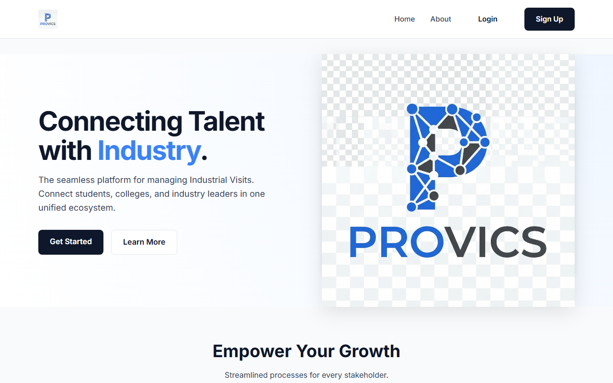
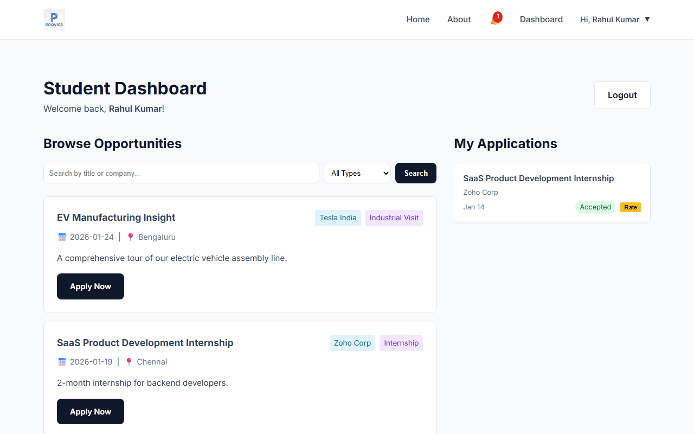
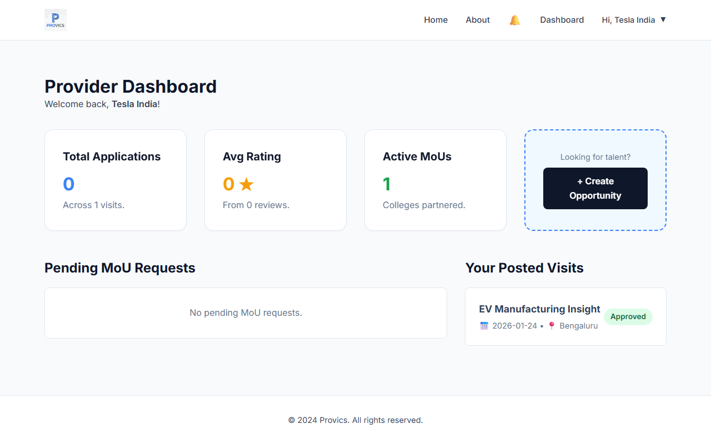
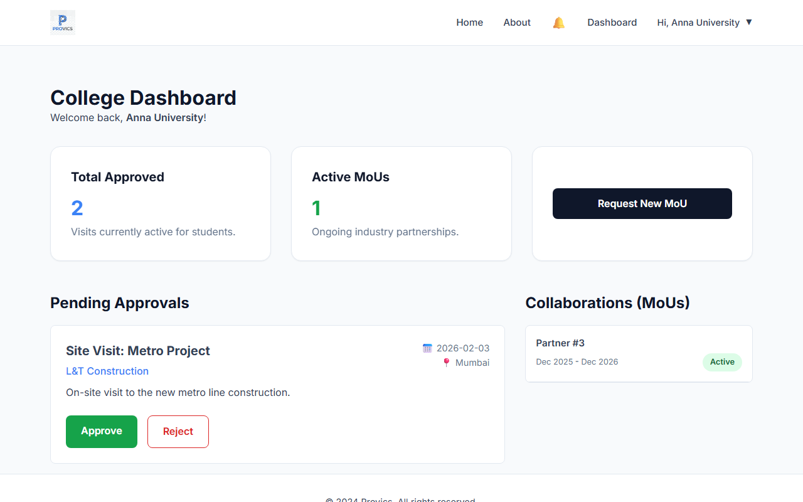

# Provics - Industrial Visit & Internship Platform

Provics is a comprehensive web platform designed to streamline the coordination of Industrial Visits (IVs), Internships, and Mentorships. It connects Students, Colleges, and Industry Service Providers in a unified ecosystem, automating operational workflows like approvals, MoUs, and notifications.



## 🚀 Key Features

### 1. Multi-Role Ecosystem
*   **Students**: Browse opportunities, receive AI-driven recommendations based on skills, apply for visits/internships, and track status.
*   **Colleges**: Approve/Reject visit requests from students, request MoUs with industries, and manage partnerships.
*   **Providers (Industries)**: Post opportunities, manage applications, and sign digital MoUs.
*   **Admin**: Complete system oversight.

### 2. Automation & Intelligence
*   **AI Recommendations**: Matches students to opportunities using keyword similarity (Skills vs. Description).
*   **Automated MoUs**: MoUs track their own validity. When they expire, the system automatically updates their status and emails both parties.
*   **Real-time Notifications**: Immediate email alerts for critical actions (Signups, Applications, OTPs).

### 3. Security
*   **Secure Authentication**: Password hashing, session management.
*   **OTP Verification**: 
    *   **Forgot Password**: Secure email loop for resetting credentials.
    *   **Account Deletion**: Requires email OTP verification for irreversible actions.
*   **Role-Based Access Control (RBAC)**: Strict route protection ensuring Students cannot access Admin panels, etc.

## 📸 Screenshots

### Student Dashboard & AI Recommendations

*Personalized recommendations highlighting "High Match" opportunities.*

### Provider Analytics

*Real-time stats on applications, ratings, and MoU requests.*

### MoU Management (College View)

*Tracking active and pending partnerships.*

## 🛠️ Tech Stack

*   **Backend**: Python, Flask, SQLAlchemy
*   **Frontend**: HTML5, CSS3 (Custom Design System), Jinja2
*   **Database**: SQLite (Dev) / PostgreSQL (Prod)
*   **AI/ML**: Python standard libraries (difflib/collections) for keyword matching.
*   **Email**: Flask-Mail (SMTP with Gmail)

## 📦 Installation & Setup

1.  **Clone the Repository**
    ```bash
    git clone https://github.com/yourusername/provics.git
    cd provics
    ```

2.  **Install Dependencies**
    ```bash
    pip install -r requirements.txt
    ```

3.  **Configure Environment**
    Create a `.env` file in the root:
    ```ini
    SECRET_KEY=your_secret_key
    MAIL_USERNAME=your_email@gmail.com
    MAIL_PASSWORD=your_app_password
    ```

4.  **Initialize Database**
    ```bash
    python reset_db.py  # Warning: Wipes existing data
    # OR
    python populate_demo_data.py # To seed dummy data
    ```

5.  **Run the App**
    ```bash
    python app.py
    ```
    Visit `http://127.0.0.1:5000`

## 🤝 Workflow Example

1.  **Provider (`tesla@test.com`)** posts a new "Factory Tour".
2.  **College (`anna@test.com`)** requests an MoU with Tesla.
3.  **Provider** accepts the MoU -> Status becomes "Active".
4.  **Student (`rahul@test.com`)** sees the tour recommended (95% Match) and applies.
5.  **Provider** gets an email notification and accepts the application.

## 📄 License
MIT License.
